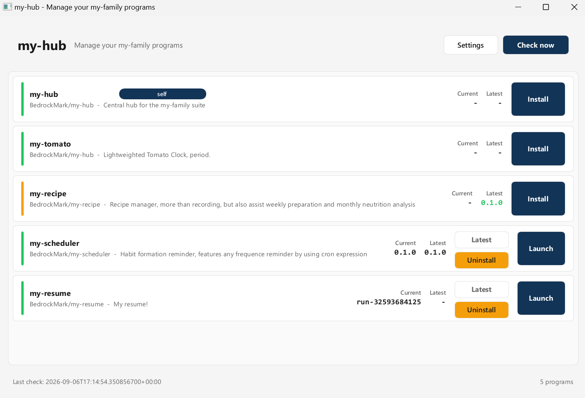
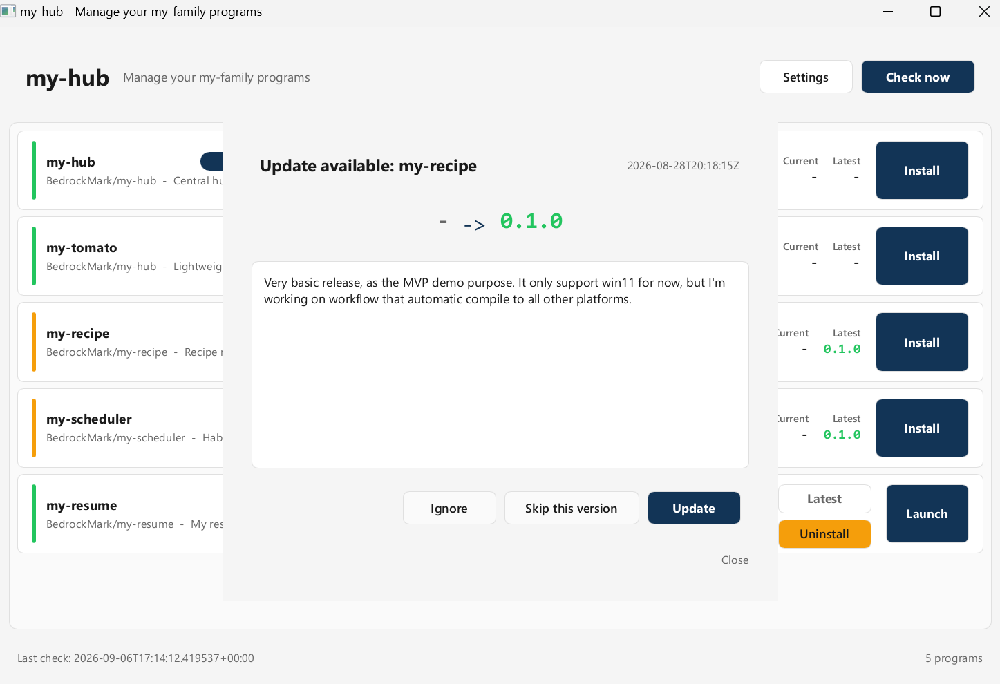
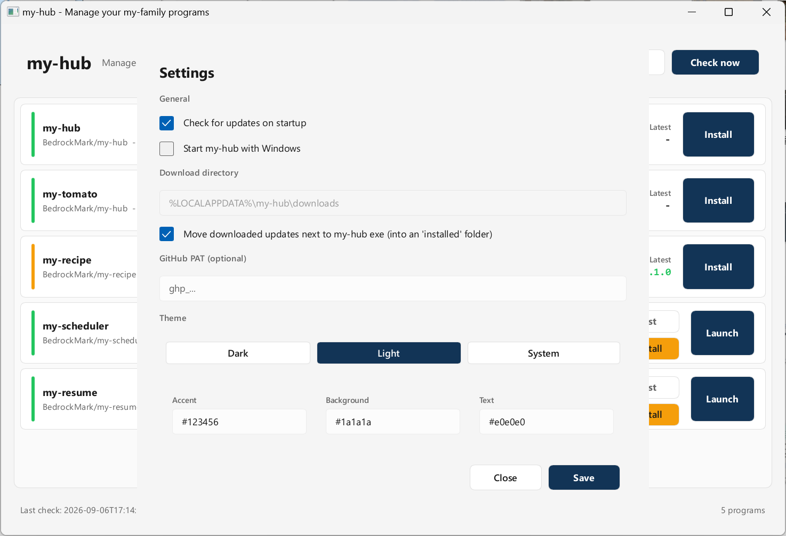

<!-- ⚠️ IMAGE SETUP REQUIRED -->
<!-- Create folder `screenshots/` in project root. See Screenshot Reference Table at the bottom of this README for what images to add. Delete this comment block after adding images. -->

# my-hub

> The control centre of the `my-*` family: one native Windows app to discover, download, update, and launch every project in the family — including itself.

[](https://www.gnu.org/licenses/gpl-3.0)


---

## 🎯 What Problem Does This Solve?

A growing collection of `my-*` applications quickly turns into a mess: which versions are installed? Which have new releases on GitHub? Where do I download them? Keeping track manually means opening each repository, reading each Releases page, and comparing versions by eye.

**my-hub solves this in two ways:**

1. **It is the family's storefront.** As the pinned, entry-point repository of the `my-*` series, it presents the whole family in one place — a curated index that says *"here is everything I build."*

2. **It is the family's installer.** Built as a native Windows desktop app, it reads a manifest of all `my-*` programs, checks GitHub Releases for newer versions, and offers one-click download, install, update, and launch for every member — no command line, no manual release hunting.

my-hub is a first-class member of the family itself: it participates in the same update flow as every other program, so it can keep itself current.

---

## 👨‍👩‍👧 The `my-*` Family

This repository is the central hub for the whole `my-*` family. Each member is a standalone project; my-hub simply gives them a single face.

| Project | Description |
|---------|-------------|
| [my-hub](https://github.com/BedrockMark/my-hub) | **This project** — central download / update / launch centre for the family |
| [my-tomato](https://github.com/BedrockMark/my-tomato) | **Tomato Clock** — Extremely lightweighted |
| [my-recipe](https://github.com/BedrockMark/my-recipe) | **Recipe Recorder & Planner** — manage recipe, weekly-preparation, and monthly neutrition analysis |
| [my-scheduler](https://github.com/BedrockMark/my-scheduler) | **Habit Manager** — habit formation reminder, features any frequence by using cron expression |
| ~~[my-resume](https://github.com/BedrockMark/my-resume)~~ | (Non-public until privacy checked with career advisor) ~~My resume!~~ |

<!-- > **Add a new family member** — insert a row below, replacing the placeholders, and keep it in sync with the family's shared manifest (`assets/default-manifest.toml`):

```markdown
| [my-<project-name>](https://github.com/<your-username>/my-<project-name>) | <one-line description> |
``` -->

---

## ⚡ Key Features

| Feature | Impact |
|---------|--------|
| Manifest-driven family registry | A single TOML file defines every `my-*` program (GitHub repo, executable, description). A default manifest is embedded in the binary; users can override or extend it with their own `manifest.toml`. |
| GitHub Releases integration | Fetches the latest release for each program via the GitHub REST API (async `reqwest` + `tokio`). Optional Personal Access Token in settings lifts the rate limit from 60 to 5,000 requests/hour. |
| Semver-based update detection | Compares the latest release tag against the locally installed version (from `state.json`) with strict semantic-version parsing — no fragile checksum lists to maintain. |
| Manual-first update dialogs | Per-program notifications with **Update / Skip This Version / Ignore This Program**. Nothing is ever downloaded or replaced without an explicit user click. |
| Install · Update · Launch · Uninstall | Per-program buttons: install the latest release directly, replace the installed binary on update, launch with the OS default handler, or remove the program. |
| Self-updating hub | my-hub is listed in its own manifest, so it updates itself through the very same flow it provides for its siblings. |
| Modern, themable GUI (Slint) | Responsive native window with dark/light themes plus user-customizable accent, background, and text colours — two independent colour sets, one per theme. |
| Fully configurable & transparent | `settings.toml` for preferences (startup check toggle, auto-start with Windows, download directory, PAT, theme), `state.json` for install history and ignore lists — all plain text, hot-loaded on next launch. |

---

## 🏗️ Architecture

```
┌────────────────────────────────────────────────────────────┐
│                    my-hub (Slint GUI)                      │
│  Main window · Update dialogs · Settings panel · Themes    │
└───────────┬──────────────────────────────┬─────────────────┘
            │ ui_bridge.rs                 │
┌───────────▼──────────────────────────────▼─────────────────┐
│                      AppState (core)                       │
│  config: settings.toml + manifest.toml + embedded default  │
│  update : checker → downloader → replace (state.json)      │
│  github : REST client + release model                      │
│  platform: Windows registry / paths / launch               │
└───────────┬──────────────────────────────┬─────────────────┘
            │                              │
   ┌────────▼────────┐           ┌─────────▼─────────┐
   │   GitHub REST   │           │   Local disk      │
   │   /releases/    │           │ %APPDATA%\my-hub\ │
   └─────────────────┘           └───────────────────┘
```

**Key decisions & rationale:**

- **Rust + Slint for the GUI** — declarative UI markup with native rendering performance, compiled into a single small executable; no web runtime, no Electron-style memory overhead.
- **Every program is just data** — the app itself contains zero hard-coded knowledge of its siblings. Adding a family member (or removing one) is an edit to a TOML file, not a code change.
- **Semver instead of SHA-256** — version tags are already maintained per repository; comparing tags is simpler and equally reliable for this trust model, and it removes an entire class of checksum-maintenance chores.
- **Manual-first by design** — automatic background downloads and silent self-replacement are excluded from scope. Every update is user-initiated and user-visible, which keeps the tool predictable on a personal machine.
- **Local state is plain JSON** — no database. Installed versions, ignored versions, and per-program flags live in a readable `state.json`.

---

## 📊 By the Numbers

| Metric | Value |
|--------|-------|
| Source files (`.rs` + `.slint`) | 21 |
| Lines of Rust & Slint | ≈ 2,700 |
| Runtime binaries | 2 (`my-hub`, `build-installer`) |
| Config / state files (plain text) | 3 (`settings.toml`, `manifest.toml`, `state.json`) |
| Programs in default manifest | 2 (including my-hub itself) |
| Distribution format | Per-user MSI (no admin rights) |
| Telemetry | 0 — fully offline, no usage reporting |

---

## 🚀 Quick Start

> Platform: **Windows 11**. Requires the [Rust toolchain](https://rustup.rs) (MSVC target).

```powershell
# 1. Clone
git clone https://github.com/BedrockMark/my-hub.git
cd my-hub

# 2. Run in dev mode (opens the GUI window)
cargo run

# 3. Release build
cargo build --release          # -> target\release\my-hub.exe

# 4. Build the per-user MSI installer
cargo run --release --bin build-installer
#    -> target\wix\my-hub-<version>-x86_64.msi
```

Install the MSI (or just run `my-hub.exe`) and the main window lists every program in the embedded manifest. Updates are only ever applied when you click **Update**.

### Configuration & state locations

| File | Location | Purpose |
|------|----------|---------|
| `settings.toml` | `%APPDATA%\my-hub\` | Preferences: startup update check, auto-start, download directory, optional PAT, theme & custom colours |
| `state.json` | `%APPDATA%\my-hub\` | Installed versions, skipped/ignored programs |
| `manifest.toml` | `%APPDATA%\my-hub\` | User program manifest (optional — overrides/extend the embedded default) |
| Downloads | `%LOCALAPPDATA%\my-hub\downloads\` | Update download cache |

### Manifest format (one entry per family member)

```toml
[[program]]
id          = "my-resume"        # unique slug (key used in state.json)
name        = "my-resume"        # display name
owner       = "BedrockMark"      # GitHub owner
repo        = "my-resume"        # GitHub repository
executable  = "main.pdf"         # file name inside the release asset
description = "My resume!"       # optional
enabled     = true               # optional, default true
```

---

## 🔧 Tech Stack

| Technology | Purpose | Why This? |
|-----------|---------|-----------|
| Rust (edition 2021) | Whole application | Memory safety + native performance in a single small binary; the family's language of choice |
| Slint 1.x | GUI framework | Declarative UI compiled to native code with software rendering — fast, lightweight, no web stack |
| tokio + reqwest (rustls) | Async HTTP to GitHub API | De-facto standard Rust async stack; rustls keeps TLS dependency-free of OpenSSL |
| serde + toml + serde_json | Config & state | Native, human-readable formats for every persisted file |
| semver | Version comparison | Exact, spec-compliant release-tag comparison for update detection |
| winreg + dirs + opener | Windows integration | Auto-start registry key, standard data paths, native launch of installed programs |
| rust-msi (`build-installer`) | MSI packaging | Generates a genuine per-user Windows Installer package (Start Menu entry, uninstall info) from pure Rust |
| tracing | Logging | Structured, filterable logs without heavy dependencies |

---

## 📸 Screenshots







---

## 🔒 Security & Privacy

- **No telemetry, no analytics, no usage reporting** — the app makes network calls only when checking for updates or downloading one, and nothing else leaves the machine.
- **Manual-first updates** — no background downloads, no silent binary replacement; every action is a visible, user-confirmed click.
- **Optional PAT stays local** — if you add a GitHub token to lift the API rate limit, it is stored only in your own `settings.toml`.
- **TLS via rustls** — all GitHub traffic is encrypted with a pure-Rust TLS implementation.

---

## 📈 Roadmap

- Theme colour presets (e.g. GitHub Dark, Solarized) on top of the current custom colour pickers
- Choose per-user vs per-machine install during MSI setup
- Global "Check now" refresh flow and richer per-program release notes
- Anything the family needs next — suggestions welcome via issues

---

## 👥 Contributing

This project is part of a personal family of tools, but contributions are welcome: open an issue for ideas or a pull request for changes. All my-family projects share the same style — small, focused, single-purpose tools with plain-text configuration.

---

## 📄 License

[GPL-3.0-or-later](https://www.gnu.org/licenses/gpl-3.0) — free software: you may redistribute and/or modify it under the terms of the GNU General Public License as published by the Free Software Foundation, either version 3 of the License, or (at your option) any later version.

---

<!-- ⚠️ IMAGE SETUP INSTRUCTIONS ⚠️ -->
<!-- After adding images to the `screenshots/` folder, delete this entire comment block AND the "⚠️ IMAGE SETUP REQUIRED" comment at the very top of this README. -->

<!-- ## 📸 Screenshot Reference Table

> Create a `screenshots/` folder in the project root with the images listed below.

| File Path | Description | Content Requirements |
|-----------|-------------|---------------------|
| `screenshots/main-window.png` | Main program list | Show the main window with the my-family program rows (e.g. my-hub, my-resume), each showing its installed version plus its action buttons; at least one row should display an "Update" state. Resolution: 1920×1080. |
| `screenshots/update-dialog.png` | Update available dialog | Show the dialog for a single program: old → new version, release date, and the four actions (Update / Skip This Version / Ignore This Program / Close). Resolution: 1920×1080. |
| `screenshots/settings-theme.png` | Settings panel, theme tab | Show the Settings panel with the theme section visible: dark/light/system choice plus the three custom colour pickers (accent, background, text). Resolution: 1920×1080. | -->
